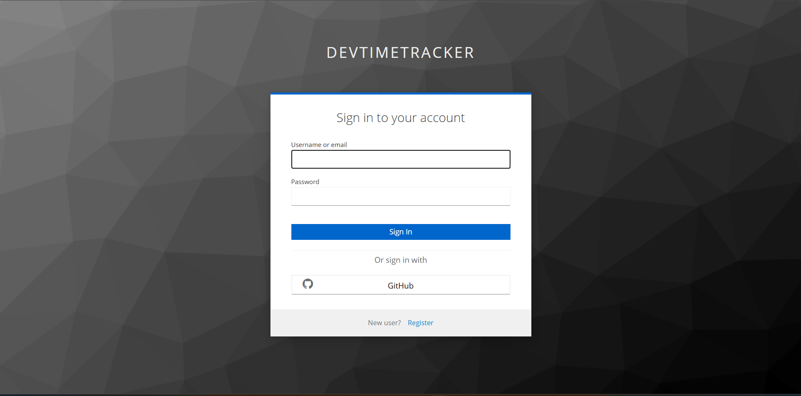

# Keycloak Integration with Spring Boot 3

This project demonstrates how to secure a Spring Boot application using Keycloak, a powerful open-source Identity and Access Management tool.

## Features

- Single Sign-On (SSO) with OpenID Connect
- Role-Based Access Control (RBAC)
- Fine-Grained Authorization

## Prerequisites

- Java 17+
- Maven
- Keycloak Server 21+

## Getting Started

These instructions will get you a copy of the project up and running on your local machine for development and testing purposes.

### Installation

1. Clone the repository:
    ```bash
    git clone git@github.com:ali-bouali/keycloak-integration-with-spring-boot-3.git
    ```
2. Navigate into the project directory:
    ```bash
    cd your-repository-name
    ```
3. Use Maven to build the project:
    ```bash
    mvn clean install
    ```
4. You can then run the Spring Boot application using:
    ```bash
    mvn spring-boot:run
    ```

### Keycloak Setup

1. Run the docker-compose file:
    ```bash
    docker-compose up -d
    ```
2. Navigate to [Keycloak Admin UI Console](http://localhost:8080 "Keycloak Admin UI Console")
3. Create a new Real and name ut ```devTimeTracker``` or update the ```application.yml``` file and specify your Realm name
4. Create Roles
5. Create Users
6. Assign roles to users

## Usage
TBD

## 🌐 Realm OpenID Configuration

http://localhost:8080/realms/devTimeTracker/.well-known/openid-configuration


## 🔁 Realm Export & Import
📤 Export Realm (Windows + Docker) 

```powershell
    docker exec -it keycloak /opt/keycloak/bin/kc.sh export --dir /opt/keycloak/data/export --realm devTimeTracker --users realm_file
```

```powershell
    docker cp keycloak:/opt/keycloak/data/export/devTimeTracker-realm.json .
```

## ✅ How to Use Login

1. Open terminal and run:

   ```powershell
   cd .\keycloak-auth-test-web\
   npm install
   npm run dev
   ```

2. Open your browser and go to:
   👉 [http://localhost:5173/](http://localhost:5173/)

3. Use the **Login** button in the app to sign in via Keycloak.

4. After successful login, you will be redirected **back to the same page** (`http://localhost:5173/`).

5. You can use the **Logout** button to sign out — you will also be redirected back to this page after logout.


## 🔐 GitHub Authentication Support

This project supports third-party authentication via **GitHub** using Keycloak Identity Provider integration.

### 🔧 How to Enable GitHub Login

1. Go to your Keycloak Admin Console → *Identity Providers*.

2. Click **Add provider** → Choose **GitHub**.

3. Fill in the required fields:

   * **Client ID** and **Client Secret**:
     Create a new OAuth App on [GitHub Developer Settings](https://github.com/settings/developers)
     Set the **Authorization callback URL** to:

     ```
     http://localhost:8080/realms/devTimeTracker/broker/github/endpoint
     ```

4. Save the identity provider.

5. Now, users can log in with GitHub when they click the **Login** button in the frontend app.

### ✅ Example Flow

* User clicks **Login**
* Redirected to Keycloak login page
* Chooses **Login with GitHub**
* Grants access
* Redirected back to `http://localhost:5173/` with active session


---
## Contributing

Pull requests are welcome. For major changes, please open an issue first to discuss what you would like to change.

Please make sure to update tests as appropriate.

## License

This project is licensed under the MIT License - see the LICENSE.md file for details
